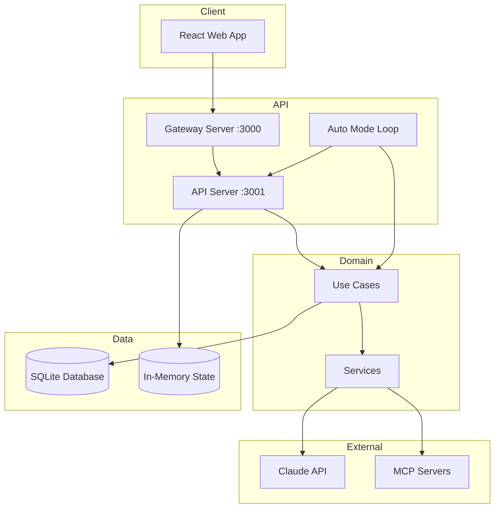
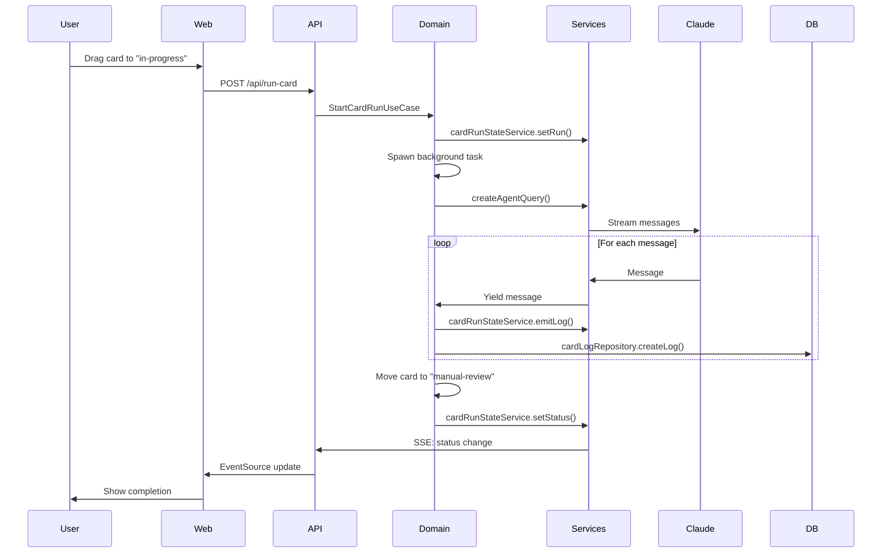
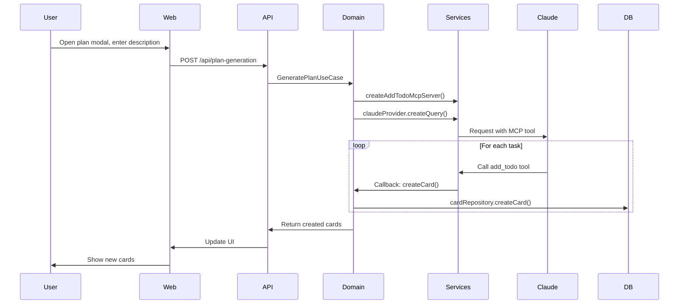
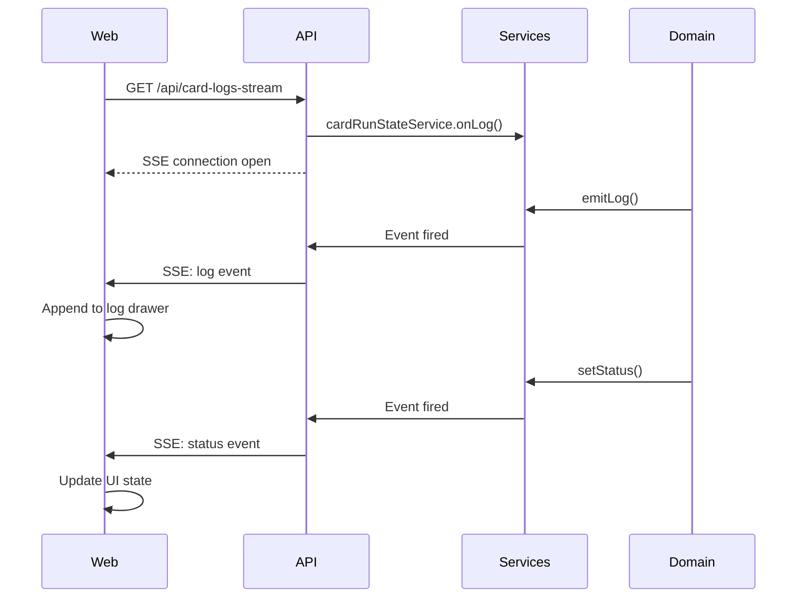
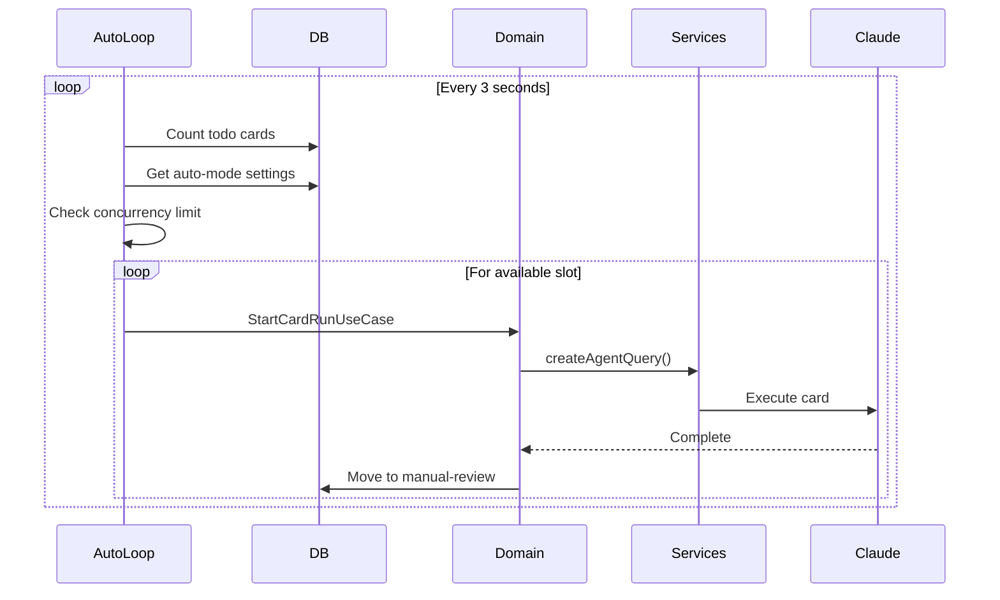

# Codebase Map

> Auto-generated by Cartographer. Last mapped: 2026-02-19T03:33:34Z

## System Overview

**AutoBoard** is an AI-powered Kanban board application that uses Claude to automatically execute development tasks. It features a monorepo architecture with separate API, web frontend, and shared packages.



## Architecture Layers

The application follows a clean layered architecture:

1. **API Layer** (`apps/api/`) - HTTP REST API with Hono framework
2. **Domain Layer** (`packages/domain/`) - Business logic and use cases
3. **Services Layer** (`packages/services/`) - External integrations (Claude, MCP)
4. **Data Layer** (`packages/db/`) - Database access with Drizzle ORM
5. **Shared Layer** (`packages/shared/`) - Types and errors
6. **Web Layer** (`apps/web/`) - React frontend with Vite

## Directory Structure

```
autoboard/
├── apps/
│   ├── api/                    # HTTP API server (Hono)
│   │   ├── src/
│   │   │   ├── controllers/    # Route handlers
│   │   │   ├── index.ts        # Main entry point
│   │   │   ├── auto-mode-loop.ts    # Background polling service
│   │   │   └── error-handler.ts
│   │   └── gateway.js          # Dev proxy server
│   │
│   └── web/                    # React frontend
│       ├── src/
│       │   ├── api/            # API client functions
│       │   ├── atoms/          # Jotai state management
│       │   ├── components/     # React components
│       │   ├── pages/          # Route pages
│       │   └── app.css         # Global styles
│       └── vite.config.ts
│
├── packages/
│   ├── db/                     # Database layer
│   │   ├── src/
│   │   │   ├── schema.ts       # Drizzle schema definitions
│   │   │   ├── client.ts       # Database connection
│   │   │   ├── types.ts        # Domain types
│   │   │   └── repositories/   # Data access layer
│   │   └── drizzle/            # Migrations and database file
│   │
│   ├── domain/                 # Business logic
│   │   └── src/                # Use cases (one per file)
│   │
│   ├── services/               # External integrations
│   │   └── src/
│   │       ├── claude-provider.ts     # Claude API wrapper
│   │       ├── card-run-state.ts      # In-memory state service
│   │       └── add-todo-mcp.ts        # MCP server for plan generation
│   │
│   └── shared/                 # Shared types/errors
│       └── src/
│
├── scripts/                    # Deployment and service scripts
├── docs/                       # Documentation
└── package.json                # Monorepo root (pnpm workspace)
```

## Module Guide

### API Server (`apps/api/`)

**Purpose**: HTTP REST API backend for the Kanban board
**Entry point**: `apps/api/src/index.ts`
**Port**: 3001 (gateway on 3000)

| File | Purpose | Tokens |
|------|---------|--------|
| `src/index.ts` | Main server, router composition | 593 |
| `src/auto-mode-loop.ts` | Background polling for auto-mode | 1005 |
| `src/error-handler.ts` | Domain error to HTTP mapping | 151 |
| `src/controllers/*.ts` | Route handlers (8 files) | ~4,500 |
| `gateway.js` | Dev proxy server | 392 |

**Exports**:
- Hono server with `/api` prefix
- Controllers for cards, projects, runs, logs, auto-mode
- Auto-mode polling singleton

**Dependencies**:
- `@hono/node-server` - HTTP server
- `@autoboard/domain` - Use cases
- `@autoboard/db` - Repositories
- `@autoboard/services` - State management

**Dependents**: Web app (via gateway proxy)

**Key Patterns**:
- Factory pattern for controllers (dependency injection)
- Singleton pattern for auto-mode loop
- Route composition with separate `Hono()` instance

**Gotchas**:
- Auto-mode loop has potential race conditions in `poll()` method
- No rate limiting on endpoints
- Non-persistent state (lost on restart)

---

### Web Frontend (`apps/web/`)

**Purpose**: React-based Kanban board UI
**Entry point**: `apps/web/src/main.tsx`
**Framework**: React 18 + Vite

| File | Purpose | Tokens |
|------|---------|--------|
| `src/main.tsx` | Application bootstrap | 71 |
| `src/App.tsx` | Root component with routing | 174 |
| `src/pages/Index.tsx` | Main dashboard | 1,340 |
| `src/components/KanbanBoard.tsx` | Main board with drag-drop | 2,828 |
| `src/components/LogDrawer.tsx` | Real-time log viewer | 2,257 |
| `src/components/KanbanColumn.tsx` | Column component | 1,730 |
| `src/components/KanbanCard.tsx` | Draggable card | 932 |
| `src/components/TopBar.tsx` | Project tabs and controls | 1,275 |
| `src/api/*.ts` | API client functions (7 files) | ~2,500 |
| `src/atoms/log-drawer.ts` | Jotai state for drawer | 344 |
| `src/app.css` | Global styles (glass morphism) | 12,798 |

**Exports**:
- React SPA with client-side routing
- API client functions for all endpoints
- Jotai atoms for state management

**Dependencies**:
- `react`, `react-dom` - UI framework
- `@dnd-kit/core` - Drag and drop
- `jotai` - State management
- `react-router-dom` - Routing
- `@autoboard/shared` - Shared types

**Dependents**: None (client-side application)

**Key Patterns**:
- Server-Sent Events (EventSource) for real-time logs
- Jotai for global state (drawer)
- Custom ref pattern for cross-component callbacks
- Glass morphism design language

**Gotchas**:
- Multiple polling intervals running simultaneously
- EventSource must be manually cleaned up
- Heavy CSS file (13k tokens)

---

### Database Package (`packages/db/`)

**Purpose**: Data access layer with Drizzle ORM and SQLite
**Entry point**: `packages/db/src/index.ts`

| File | Purpose | Tokens |
|------|---------|--------|
| `src/schema.ts` | Drizzle schema definitions | 443 |
| `src/client.ts` | Database connection singleton | 157 |
| `src/types.ts` | Domain types (DTOs) | 395 |
| `src/repositories/project-repository.ts` | Project CRUD | 505 |
| `src/repositories/card-repository.ts` | Card CRUD with soft delete | 756 |
| `src/repositories/card-log-repository.ts` | Card log storage | 430 |
| `src/repositories/auto-mode-settings-repository.ts` | Auto-mode settings | 438 |

**Exports**:
- `db` - Drizzle database instance
- Schema definitions (projects, kanbanCards, cardLogs, autoModeSettings)
- Repository singletons for all entities
- Domain types (Project, Card, CardLog, AutoModeSettings)

**Dependencies**:
- `drizzle-orm` - ORM
- `better-sqlite3` - SQLite driver

**Dependents**: Domain layer (use cases), API layer

**Key Patterns**:
- Repository pattern with class-based implementation
- Soft delete pattern for cards (`archivedAt` timestamp)
- Singleton instances exported
- Domain types separate from database schema

**Gotchas**:
- No foreign key constraints (logical relationships only)
- No cascading deletes (must handle manually)
- No transaction support
- Sequence numbers for logs are application-managed

---

### Domain Package (`packages/domain/`)

**Purpose**: Business logic layer - use cases for all operations
**Entry point**: `packages/domain/src/index.ts`

| File | Purpose | Tokens |
|------|---------|--------|
| `src/get-projects.ts` | Query all projects | 84 |
| `src/create-project.ts` | Create project with directory | 245 |
| `src/update-project.ts` | Update project fields | 275 |
| `src/delete-project.ts` | Delete project (cascade) | 261 |
| `src/get-cards.ts` | Query cards | 122 |
| `src/create-card.ts` | Create card | 267 |
| `src/update-card.ts` | Update card | 290 |
| `src/delete-card.ts` | Delete card | 116 |
| `src/archive-card.ts` | Soft archive card | 176 |
| `src/get-archived-cards.ts` | Query archived cards | 146 |
| `src/generate-plan.ts` | AI-powered plan generation | 612 |
| `src/generate-card-title.ts` | AI title generation | 625 |
| `src/start-card-run.ts` | ⭐ Main card execution flow | 1,534 |
| `src/get-card-run-status.ts` | Query run status | 204 |
| `src/cancel-card-run.ts` | Cancel running card | 198 |
| `src/toggle-auto-mode.ts` | Enable/disable auto-mode | 227 |
| `src/set-auto-mode-concurrency.ts` | Set worker count | 209 |
| `src/get-auto-mode-status.ts` | Query auto-mode status | 271 |

**Exports**:
- All use cases as pure functions
- Input/Result types for each use case

**Dependencies**:
- `@autoboard/db` - Repositories
- `@autoboard/services` - Claude provider, MCP tools
- `@autoboard/shared` - Domain errors

**Dependents**: API layer (controllers)

**Key Patterns**:
- Use case pattern (one file per use case)
- Repository pattern for data access
- Composition (use cases call other use cases)

**Gotchas**:
- `start-card-run.ts` is the most complex file - handles message classification, persistence, and state management
- `generate-plan.ts` uses MCP server for tool calling during generation
- Session IDs stored for resumption capability

---

### Services Package (`packages/services/`)

**Purpose**: External service integrations and state management
**Entry point**: `packages/services/src/index.ts`

| File | Purpose | Tokens |
|------|---------|--------|
| `src/claude-provider.ts` | ⭐ Claude API wrapper | 871 |
| `src/agent-service.ts` | Convenience wrapper | 360 |
| `src/agent-query.interface.ts` | TypeScript interfaces | 305 |
| `src/card-run-state.ts` | ⭐ In-memory state service | 940 |
| `src/add-todo-mcp.ts` | MCP server for plan gen | 477 |

**Exports**:
- `claudeProvider` - Singleton Claude API adapter
- `cardRunStateService` - In-memory run state singleton
- `createAddTodoMcpServer()` - MCP server factory
- `IAgentCodeQuery` interface

**Dependencies**:
- `@anthropic-ai/claude-agent-sdk` - Official Claude SDK
- `zod` - Schema validation for MCP tools

**Dependents**: Domain layer (use cases)

**Key Patterns**:
- Singleton pattern for services
- Adapter pattern (Claude SDK to IAgentCodeQuery)
- Event emitter pattern (card-run-state)
- Callback pattern (MCP tool handlers)

**Gotchas**:
- `cardRunStateService` is not persisted (lost on restart)
- Claude provider uses `bypassPermissions` by default
- Environment variables are whitelisted for security
- Max listeners increased to 100 for event emitter

---

### Shared Package (`packages/shared/`)

**Purpose**: Shared types and errors across packages
**Entry point**: `packages/shared/src/index.ts`

| File | Purpose | Tokens |
|------|---------|--------|
| `src/types.ts` | DTOs and interfaces | 258 |
| `src/errors.ts` | Domain error classes | 103 |

**Exports**:
- Domain types: Card, Project, AutoModeStatus, etc.
- Error classes: ValidationError, NotFoundError, ConflictError
- IAutoModeLoop interface

**Dependencies**: None (pure types)

**Dependents**: All packages

**Key Patterns**:
- DTOs separate from domain types
- Error classes mapped to HTTP status codes

**Gotchas**:
- Type differences between DTOs and domain types (optional vs nullable)

---

## Data Flow

### Card Execution Flow



### Plan Generation Flow



### Real-time Log Streaming



### Auto-mode Polling Flow



---

## Conventions

### Naming
- **Use cases**: Verb-noun pattern (`get-cards.ts`, `create-card.ts`)
- **Repositories**: `{entity}-repository.ts`
- **Controllers**: `{resource}-controller.ts`
- **API clients**: Noun resource name (`cards.ts`, `projects.ts`)
- **Components**: PascalCase (`KanbanBoard.tsx`, `LogDrawer.tsx`)

### File Organization
- One use case per file in `packages/domain/src/`
- One controller per resource in `apps/api/src/controllers/`
- Repository per entity in `packages/db/src/repositories/`
- API client per resource in `apps/web/src/api/`

### Code Patterns
- **Factory functions** for controllers (dependency injection)
- **Singleton instances** for repositories and services
- **Use case pattern** for business logic
- **Repository pattern** for data access
- **Event emitter pattern** for real-time updates

### Error Handling
- Domain errors in `@autoboard/shared` (ValidationError, NotFoundError, ConflictError)
- Controllers map domain errors to HTTP status codes (400, 404, 409)
- Repositories throw generic errors
- Unhandled errors logged and returned as 500

### State Management
- **Jotai** for global frontend state
- **useState** for local component state
- **Singleton services** for backend state
- **SQLite** for persistent state

---

## Gotchas

### Critical Issues

1. **Auto-mode race conditions**: `auto-mode-loop.ts` has non-atomic state checks in `poll()` method
2. **Non-persistent state**: `cardRunStateService` and plan generation state lost on restart
3. **No foreign keys**: Database relationships are logical only - no referential integrity
4. **Manual cascade deletes**: Deleting projects doesn't cascade - must manually delete cards
5. **No transaction support**: Repository operations can't be atomic across entities
6. **No rate limiting**: API endpoints have no throttling
7. **Sequence management**: Card log sequences are application-managed, no database auto-increment

### Important Behaviors

1. **Soft delete**: Cards use `archivedAt` timestamp - queries must explicitly filter
2. **Session resumption**: Cards store `sessionId` for resuming across runs
3. **Message truncation**: Tool results truncated to 2000 chars for database storage
4. **Auto-start**: Cards dropped to "in-progress" automatically start execution
5. **Auto-completion**: Cards move to "manual-review" after execution completes
6. **MCP namespacing**: Tools prefixed with `mcp__{server}__{tool}`
7. **Permission bypassing**: Claude provider uses `bypassPermissions` by default
8. **Environment whitelist**: Only safe env vars passed to Claude (PATH, HOME, ANTHROPIC_*)

### Development Notes

1. **Gateway proxy**: Dev uses gateway.js on 3000 → API on 3001
2. **Hot reload**: API uses `tsx watch` for development
3. **Database location**: `packages/db/drizzle/db.sqlite` (relative to dist)
4. **Build required**: Packages must be built before use
5. **ESM only**: All packages use `"type": "module"`
6. **pnpm workspace**: Uses pnpm for monorepo management

---

## Navigation Guide

### To add a new API endpoint

1. Create use case in `packages/domain/src/{use-case}.ts`
2. Create controller in `apps/api/src/controllers/{resource}-controller.ts`
3. Register route in `apps/api/src/index.ts`
4. Create API client in `apps/web/src/api/{resource}.ts`
5. Update `packages/shared/src/types.ts` if new DTOs needed

### To add a new database entity

1. Add schema in `packages/db/src/schema.ts`
2. Add domain types in `packages/db/src/types.ts`
3. Create repository in `packages/db/src/repositories/{entity}-repository.ts`
4. Export from `packages/db/src/repositories/index.ts`
5. Run migration: `cd packages/db && npm run db:generate && npm run db:migrate`

### To modify card execution logic

1. Edit `packages/domain/src/start-card-run.ts` for main flow
2. Edit `packages/services/src/claude-provider.ts` for Claude integration
3. Edit `packages/services/src/card-run-state.ts` for state management
4. Edit `apps/api/src/controllers/card-logs-controller.ts` for streaming

### To add a new component

1. Create component in `apps/web/src/components/{Component}.tsx`
2. Import and use in `apps/web/src/pages/Index.tsx` or parent component
3. Add styles to `apps/web/src/app.css` if needed
4. Create API client functions in `apps/web/src/api/` if needed

### To modify auto-mode behavior

1. Edit `apps/api/src/auto-mode-loop.ts` for polling logic
2. Edit `packages/domain/src/toggle-auto-mode.ts` for enable/disable
3. Edit `packages/domain/src/set-auto-mode-concurrency.ts` for concurrency settings

### To debug card execution

1. Check `packages/domain/src/start-card-run.ts` for message classification
2. Check `packages/services/src/card-run-state.ts` for in-memory state
3. Check `apps/api/src/controllers/card-logs-controller.ts` for SSE streaming
4. Check `apps/web/src/components/LogDrawer.tsx` for UI handling
5. Query `cardLogs` table in database for message history

---

## Technology Stack

### Backend
- **Runtime**: Node.js (ESM)
- **Framework**: Hono (HTTP server)
- **Database**: SQLite + Drizzle ORM
- **AI**: Claude API via official SDK
- **MCP**: Model Context Protocol for tool calling

### Frontend
- **Framework**: React 18
- **Build**: Vite
- **State**: Jotai
- **Routing**: React Router v7
- **DnD**: @dnd-kit/core
- **Styling**: Pure CSS (glass morphism)

### Monorepo
- **Manager**: pnpm workspaces
- **Language**: TypeScript 5
- **Module System**: ESM only

---

## Project Status

- **Total files**: 105
- **Total tokens**: 73,897
- **Architecture**: Clean architecture with clear layer separation
- **Pattern**: Use case-driven design with repository pattern
- **State**: Hybrid (persistent + in-memory)
